# How to build an end-to-end Machine Learning pipeline using AWS Glue, Amazon S3.

In this workshop, we will build an end-to-end pipeline to do some tasks about hotel. Our pipeline will combine several different data sources, use AWS Glue for serverless extract-transform-load (ETL) jobs, Amazon Simple Storage Service (S3) for storage and staging the datasets.


## Preferred Region:
The feature at the end of this lab is still in Preview (as of 05-01-2020) and available in "us-east-1". We caution however that APIs can often change between preview to when a feature becomes generally available, so we are including it in the lab for testing purposes only. 


Create S3 buckets
=================

1.  Please use Chrome or Firefox browser to ensure smooth lab experience.

2.  Sign into the AWS Management Console

3.  Click on **S3** from the list of all services. This will bring you to the S3 dashboard page.

4.  On the S3 Dashboard, create two buckets for storing **Raw** and **Processed** data as follows:

    1.  Click on **Create bucket** and then enter Bucket name:
        **\<\<USERID\>\>-raw** and click on Create. Create another
        bucket for storing processed
        objects **\<\<USERID\>\>-processed**

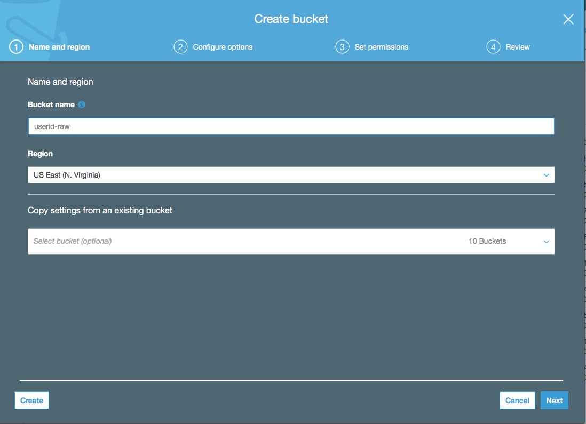
        
        
Create Glue job for extracting and storing raw data
===================================================

In this section, we will be creating two glue jobs:

a.  Import\_income\_data: To extract 2016 income data for all 50 dates
    in CSV format

b.  Import\_json\_data: To extract parks and playgrounds data in JSON
    format.

1.  Sign into the AWS Management Console
    <https://console.aws.amazon.com/>.

2.  Click on **AWS Glue** from the list of all services. This will bring
    you to the Amazon Glue dashboard page.

3.  On the Glue Dashboard, click **Jobs** on the left panel and then
    click **Add Job**
    
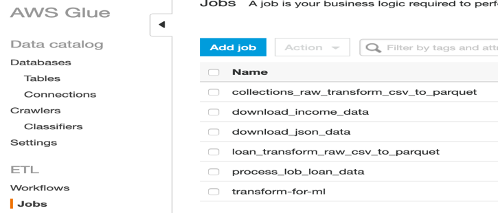

4.  Enter the following information:

    -   Name: import\_income\_data

    -   IAM Role: userid\_glue\_s3

    -   This job runs: A new script to be authored by you.

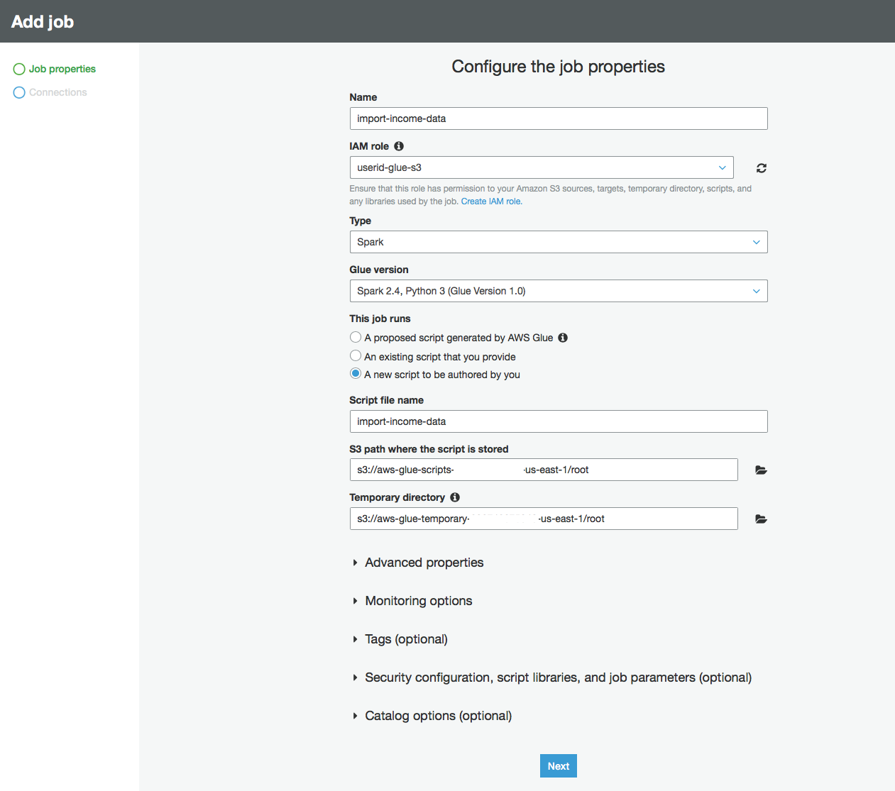

5.  Click **Next** in the lower-right corner of the screen.

6.  Click Save job and edit script

7.  Paste the following source code: Replace \<\<userid\>-raw with
    the RAW bucket you created in Create S3 buckets section.

8.  Click on Save and Run Job

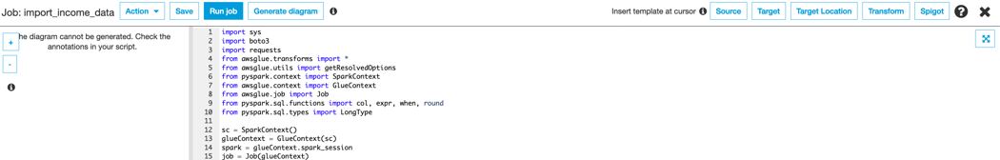

9.  Repeat steps 1-8 to create a job to import parks and playgrounds
    data in json format.

    -   Name: import\_json\_data

    -   IAM Role: userid\_glue\_s3

    -   This job runs: A new script to be authored by you.

    -   Replace **\<\<userid\>\>-raw with your userid in the source
        code below**

The python code below, downloads parks & playground data in JSON format
from the provided parks\_url & playgrounds\_url and writes it to S3 in
parquet format.


1.  Sign into the AWS Management Console
    <https://console.aws.amazon.com/>.

2.  Click on **AWS Glue** from the list of all services. This will bring
    you to the Amazon Glue dashboard page.

3.  On the Glue Dashboard, click **Crawlers** on the left panel and then
    click **Add Crawler**

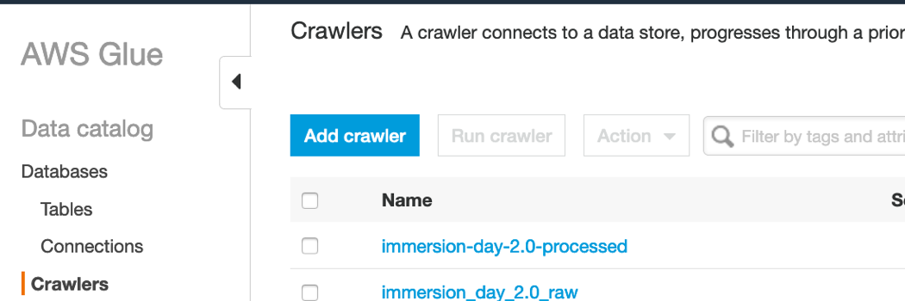

> Enter the following crawler information:

-   Name: **crawl\_raw\_data**

-   Crawler Source Type: Data stores

-   Choose Data Store: S3

-   Crawl data in: Specified path in my account

-   Include Path: \<\<userid\>\>-raw

-   Add another datastore: No

-   Choose an existing IAM role and select \<\<userid\>\>\_glue\_s3

-   Frequency: Run on demand

-   Configure Crawler's output

    1.  Add database and enter \<\<userid\>\>-raw as database name
        > and click Create

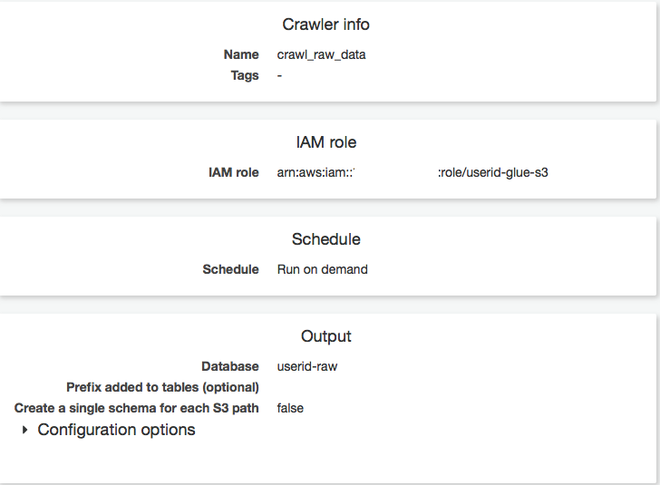

4.  Click **Finish and Run Crawler**

5.  On the left panel, click on **Databases** and select
    \<\<userid\>\>-raw and click on Tables in
    \<\<userid\>\>-raw.

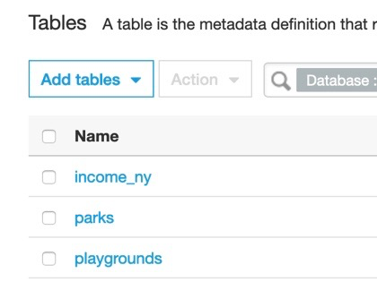

6.  Click on one of the tables (parks) to view its schema and
    partitions.

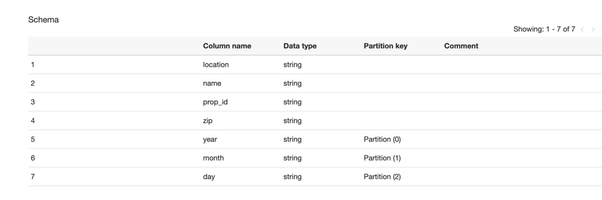


Create Glue Job to join data
======================================================

In this section we will create a glue job to combine the data into one for ML processing.

-   Name: prep\_data\_for\_ml

-   IAM Role: userid\_glue\_s3(refer to Appendix for creating this role)

-   This job runs: A new script to be authored by you.

-   Replace **\<\<userid\>\>-raw with your userid in the source code
    below**
    
-   Replace **processed_dir** with your userid in the code where it says "s3://<<userid>>-processed/processed/+path" 

> The python code does the following:

1.  Load data from the glue catalog as dynamic
    frame

2.  Filter income data and include/rename fields required for
    analysis

3.  Joi data

4.  Left outer join and combined \_income data.

5.  Write combined data to
    \<\<userid\>\>-processed bucket
    

11. Click on Save and Run Job.

12. Create a crawler to catalog and analyze process data as follows:

> From the Glue dashboard, click on **Crawlers** and **Add Crawler** and
> enter the following crawler information:

-   Name: **crawl\_processed\_data**

-   Crawler Source Type: Data stores

-   Choose Data Store: S3

-   Crawl data in: Specified path in my account

-   Include Path: \<\<userid\>\>-processed

-   Add another datastore: No

-   Choose an existing IAM role and select \<\<userid\>\>\_glue\_s3

-   Frequency: Run on demand

-   Configure Crawler's output

    1.  Add database and enter \<\<userid\>\>-processed as database
        > name and click Create

7.  Click **Finish and Run Crawler**


Automate the data processing pipeline using Glue Workflow
===================================================================

1.  Sign into the AWS Management Console
    <https://console.aws.amazon.com/>.

2.  Click on **Glue** from the list of all services. This will bring you
    to the Amazon Glue dashboard page.

3.  Click on Workflow and add Workflow

4.  Workflow name: playgrounds\_workflow\_for\_ml

5.  Add trigger to start processing workflow on demand

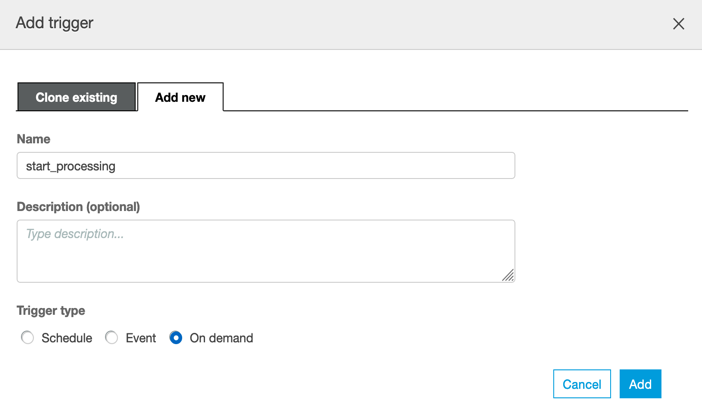

6.  Add jobs import\_json\_data and import\_income\_data to start
    trigger

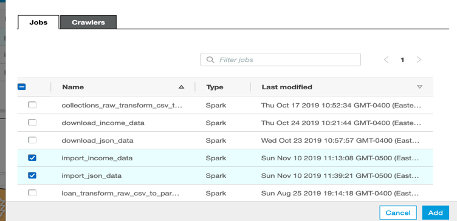

7.  Add trigger to watch the above jobs and to trigger
    raw\_data\_crawler

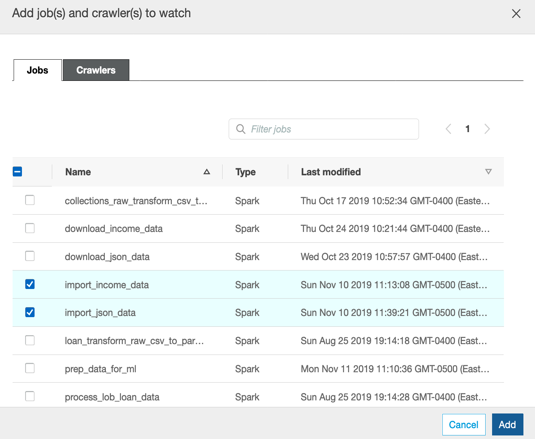
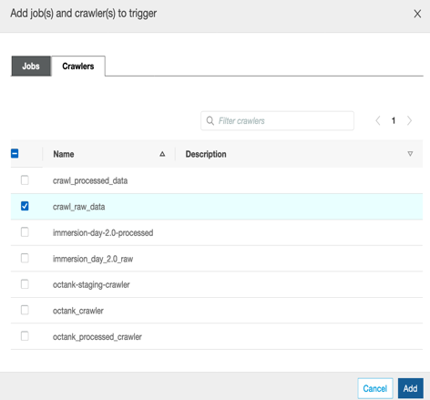

8.  Complete the workflow following the above steps

    a.  Add trigger to watch crawl\_raw\_data and trigger new event
        process\_data\_for\_ml job

    b.  Add trigger to watch process\_data\_for\_ml and trigger
        crawl\_processed\_data

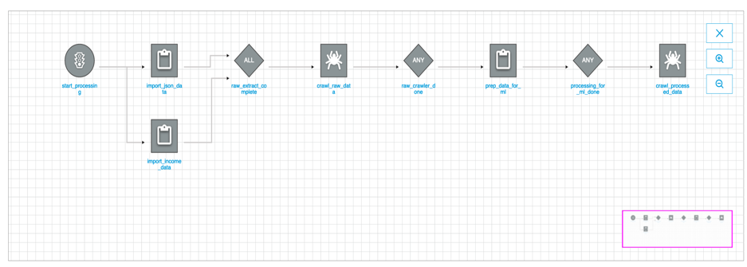

9.  Run workflow, click on History and selct the running job to monitor
    progress

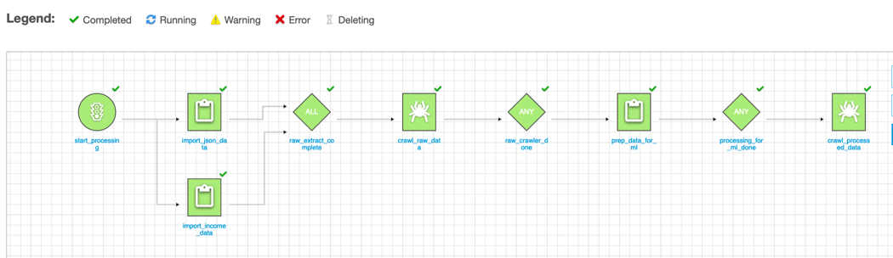

Then build a jar file with ```sbt assembly```

To submit the app to Spark use the following command:

```
spark-submit --class by.artsiom.bigdata101.hotels.Main --master local[*] hotels-spark.jar /path/to/train.csv
```

## Task 1

### Find top 3 most popular hotels between couples. (treat hotel as composite key of continent, country and market).

Result:

```shell
+---------------+-------------+------------+-------+
|hotel_continent|hotel_country|hotel_market|    cnt|
+---------------+-------------+------------+-------+
|              2|           50|         628|1190143|
|              2|           50|         675|1007502|
|              4|            8|         110| 588213|
+---------------+-------------+------------+-------+
```

## Task2

### Find the most popular country where hotels are booked and searched from the same country.

Result:

```shell
+-------------+-----+
|hotel_country|count|
+-------------+-----+
|           68| 1619|
+-------------+-----+
```

## Task3

### Find top 3 hotels where people with children are interested but not booked in the end.

Result:

```shell
+---------------+-------------+------------+------+
|hotel_continent|hotel_country|hotel_market|   cnt|
+---------------+-------------+------------+------+
|              2|           50|         682|398872|
|              2|           50|         675|294833|
|              2|           50|         628|218325|
+---------------+-------------+------------+------+
```

Spark Jobs:


